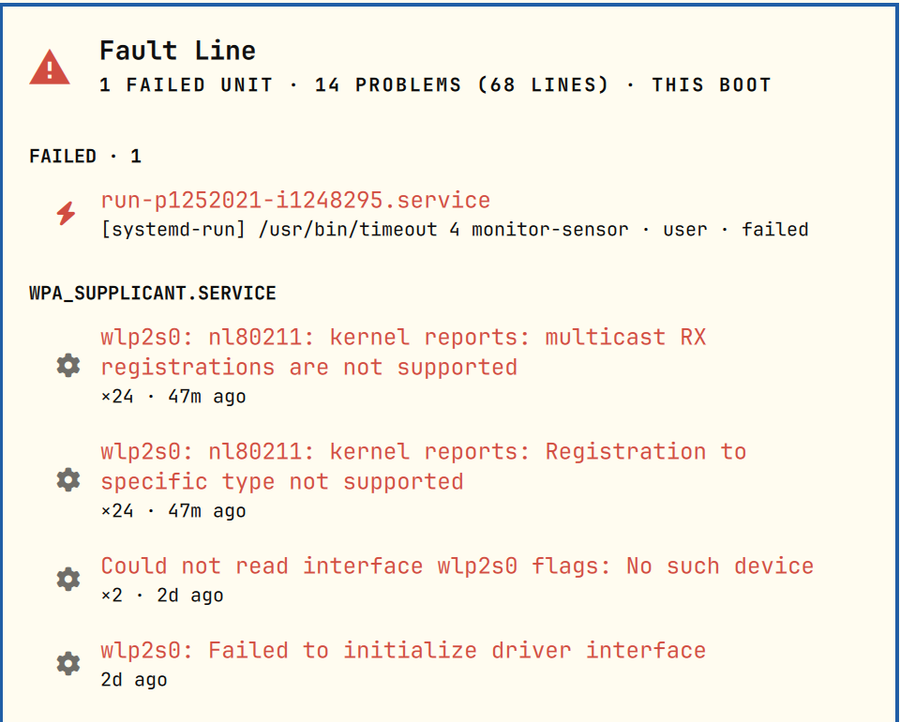

# Fault Line

What broke since boot, in the Omarchy bar.



Omarchy tells you when a program crashes. It says nothing when a service fails to start, a driver keeps logging
errors, or the kernel complains every few minutes. Fault Line reads the two places that record those things and
shows them as a short list:

- **Failed units**, system and user, from `systemctl --failed`.
- **Error lines** from the journal (`journalctl -p 3`), **folded**: a message that repeats is one row with a count,
  even when it differs in numbers (PIDs, addresses, retries). 68 lines on the machine this was written on became 14 rows.

Rows are grouped by unit, newest first. The bar icon appears only when there is something you haven't looked at;
closing the panel marks everything seen.

## Interactions

| Where | Input | Action |
|---|---|---|
| Bar | left click | open (closing marks everything seen) |
| Bar | right click | mark seen without opening |
| Bar | middle click | refresh |
| Panel | `j` / `k` / arrows | move |
| Panel | `enter` / click | diagnose with your default coding agent: it gets the unit, the shape of the problem and the exact `journalctl` command, never the log text itself |
| Panel | `i` | open that item's own log in a terminal |
| Panel | `m` | mute this problem (or unmute); it moves to a footer and stops counting |
| Panel | `t` | this boot → 24 hours → 7 days |
| Panel | `c` | copy a plain-text report |
| Panel | `r` | refresh |

Muting is by unit **and** message shape, so muting wpa_supplicant's "multicast RX registrations are not supported"
keeps any other wpa_supplicant error visible. Mutes survive reboots.

## Install

```bash
omarchy plugin add https://github.com/cgranier/omarchy-fault-line.git --enable
```

Reading the system journal needs your user in the `wheel`, `adm` or `systemd-journal` group (Omarchy's default user
is in `wheel`). Without it you still see your own user units and failed user services. Diagnosis needs a default
agent (`omarchy default agent <name>`); `wl-copy` is used for `c`.

On first run everything in this boot counts as new, so the icon shows up once and you can find it; open and close
the panel to clear it. With nothing new, open it with `omarchy-shell shell toggle cgranier.faultline '{}'`.

## Uninstall

```bash
omarchy plugin remove cgranier.faultline
rm -rf ~/.local/state/omarchy-faultline   # optional: seen marker, mutes, window
```

The shell never opens that state file itself: `bin/faultline-state` does, after checking that every directory from your
home down is yours and not writable by others, that the file is a regular file you own and under 64 KB (a symlink or FIFO
planted there is refused, not followed or waited on), and writes go to a temp file renamed into place.

Fault Line only reads the journal and `systemctl` output. It never restarts, resets or changes a unit.

The journal is written by every process on the machine, so it is treated as untrusted: reads are capped in bytes and
records, messages are cut at 500 characters, only plainly-shaped unit names ever reach a command line, and the agent
handoff carries no log text, just the command to read it, with the log declared as data.

## Settings

`omarchy bar set cgranier.faultline <key> <value> [--json]`

| Key | Default | Meaning |
|---|---|---|
| `maxPriority` | `3` | `journalctl -p`: 3 is error and worse; 4 adds warnings (expect many more rows). |
| `refreshIntervalSec` | `60` | Poll interval. |
| `alwaysShow` | `false` | Keep the icon in the bar even with nothing new. |

## IPC

```
omarchy-shell cgranier.faultline toggle | open | close
omarchy-shell cgranier.faultline status      # "1 failed unit · 14 problems (68 lines) · this boot"
omarchy-shell cgranier.faultline state       # JSON
omarchy-shell cgranier.faultline window      # cycle the window
omarchy-shell cgranier.faultline markSeen
```

## Development

```
manifest.json   plugin declaration + settings schema
Panel.qml       bar button + popup (entry point)
Service.qml     journal + systemctl reads, state file, actions
Model.js        pure logic: parsing, folding, rows, prompts
bin/faultline-state   the only thing that opens state.json (checked, bounded, atomic)
tests/          node tests; state.test.sh drives the helper
```

```bash
node tests/model.test.js
omarchy plugin validate .
```

## License

MIT
